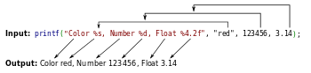

## Collaboratory Project to Implement printf() in C.

This is a project that showcases the implementation of the printf function in C programming language.

## C Language
The C programming language is a procedural programming language. It was initially developed by Dennis Ritchie as a system programming language to write operating system. The main features of C language include low-level access to memory, simple set of keywords, and clean style, these features make C language suitable for system programming like operating system or compiler development.

## printf function

The printf function is the name of one of the main C output functions, and stands for "print formatted". printf format strings are complementary to scanf format strings, which provide formatted input (lexing aka. parsing). In both cases these provide simple functionality and fixed format compared to more sophisticated and flexible template engines or lexers/parsers, but are sufficient for many purposes.

Many languages other than C copy the printf format string syntax closely or exactly in their own I/O functions.

## Concepts Utilized.

- <a href = "https://www.geeksforgeeks.org/functions-in-c/">Functions</a>
- <a href = "https://www.geeksforgeeks.org/pointers-in-c-and-c-set-1-introduction-arithmetic-and-array/">Pointers</a>
- <a href = "https://www.geeksforgeeks.org/arrays-in-c-cpp/">Array and Strings</a>
- <a href = "https://www.geeksforgeeks.org/for-versus-while/">Control Flow</a>
- <a href = "https://www.geeksforgeeks.org/g-fact-51/">Switch Statement</a>
